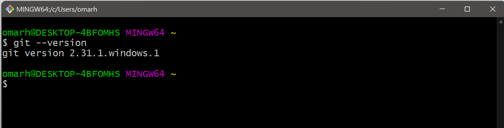
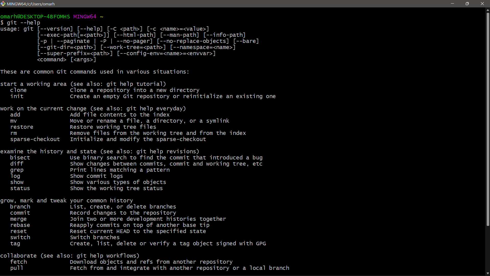
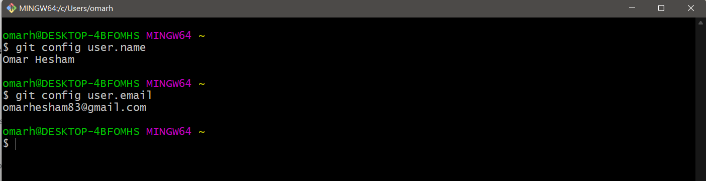
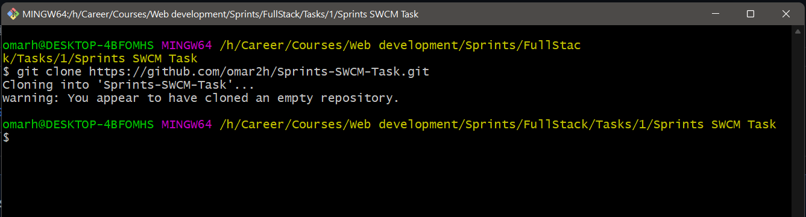
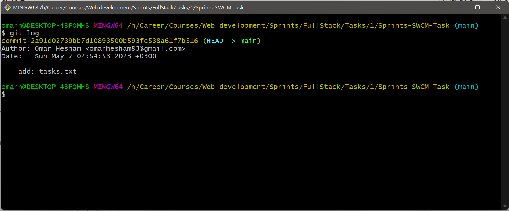
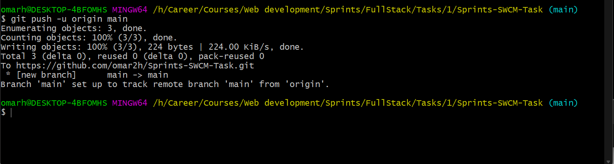
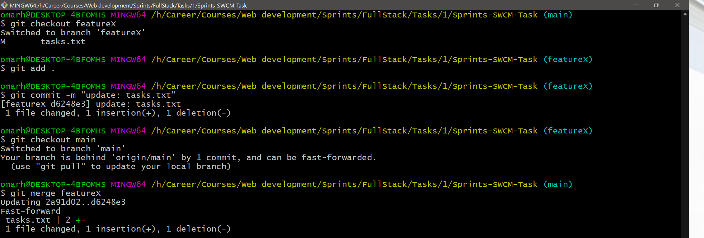
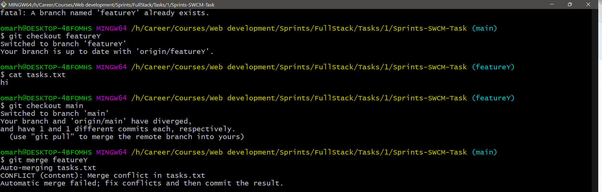
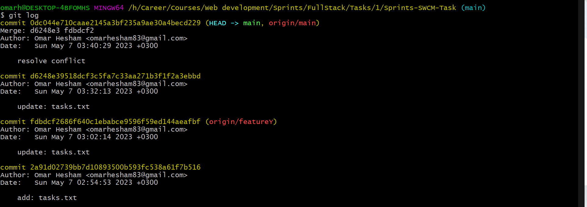

# Sprints SWCM Task

## Screenshots

1. CLI shows the current Git version
   

2. CLI showing the Git Help results
   

3. CLI showing the configured user name and email showing
   

4. CLI showing the cloning command result
   

5. CLI showing the commit history
   

6. CLI shows the push command results
   

7. CLI shows the commit history
   

8. CLI after merging the featureX branch
   

9. CLI after merging the featureY branch
   

10. CLI after resolving merge conflicts if any
    

11. CLI showing the commit history
    
